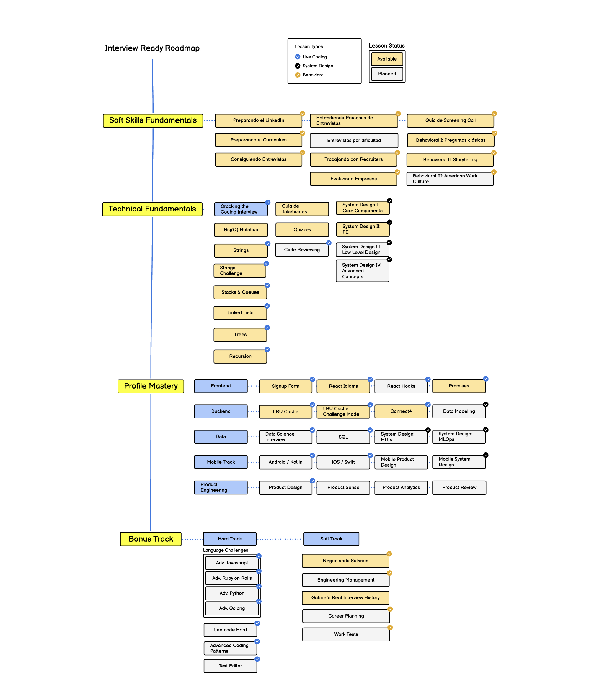

import { Callout, Cards, Steps } from 'nextra/components'
import {
  LinkIcon,
  IdCardIcon,
  ArrowRightIcon,
} from '@components/icons'

## Introducción

Interview Ready es un programa de preparación para entrevistas armado por [Gabriel Benmergui](https://www.linkedin.com/in/gabriel-benmergui/).

Nuestro objetivo es que los programadores puedan mostrar su conocimiento efectivamente en entrevistas, consiguiendo más y mejores trabajos.

En toda la [currícula](https://roadmap.sh/r/interview-ready) vas a ver ejercicios y materiales para mejorar que van a requerir esfuerzo. Distinguirse de los pares y ganar en proceso de entrevistas requiere
dominar aspectos prácticos y técnicos que hay que pulir.

Interview Ready es una iniciativa de [SilverEd](https://silver.dev/ed), un programa de reembolsos de cursos de [Silver.dev](https://silver.dev).

<Callout type="info">
  Si seguis las instrucciones del programa, vas a estar arriba de la mayoría de los candidatos en tus procesos de entrevistas.
</Callout>

### Como Realizar Interview Ready

El contenido del programa esta armado para que se pueda consultar puntualmente en base a tus necesidades concretas.
También armamos un roadmap y una agrupación lógica para ir avanzando de a poco en todos los temas a cubrir, tanto por su utilidad y la dificultad acorde.

<Steps>
### Getting Started

En esta sección empezamos con problemas de programación prácticos que abarcan una gran cantidad de entrevistas.
Ademas empezamos a pulir el perfil para conseguir más entrevistas y más atención por parte de empleadores y recruiters.

### Advanced

Profundizamos con desafíos mas avanzados que aplican a casi todos los perfiles de programadores Sr, encontrando y corrigiendo baches
en la teoría, la experiencia y la práctica. También profundizamos en herramientas soft como presentación, evaluación de empresas y como colaborar con Recruiters.

### Profile Mastery

En esta sección nos enfocamos puramente en lo técnico, resolviendo problemas específicos de varios perfiles de programadores: Frontend, Backend, Data y Mobile.
Los challenges estan pensados en problemas típicos para cada perfil, con una dificultad alta.

### The Deep End

Llegamos a los problemas mas avanzados de la industria - challenges de empresas S-Tier, expertise profunda de lenguajes y secretos e insights únicos de la industria.
Esta sección esta optimizada para Sr+ y Staff Engineers.

</Steps>

## Links Útiles

<Cards>
  <Cards.Card
    icon={<IdCardIcon />}
    title="Linkedin de Gabriel"
    target="_blank"
    rel="noopener noreferrer"
    href="https://www.linkedin.com/in/gabriel-benmergui/"
  />
  <Cards.Card
    icon={<LinkIcon />}
    title="SilverEd"
    target="_blank"
    rel="noopener noreferrer"
    href="https://docs.silver.dev/resources-and-programs/silver-ed/about-silver-ed"
  />
  <Cards.Card
    icon={<LinkIcon />}
    title="Roadmap ↗"
    target="_blank"
    rel="noopener noreferrer"
    href="https://roadmap.sh/r/interview-ready"
  />
</Cards>

## Roadmap Snapshot

